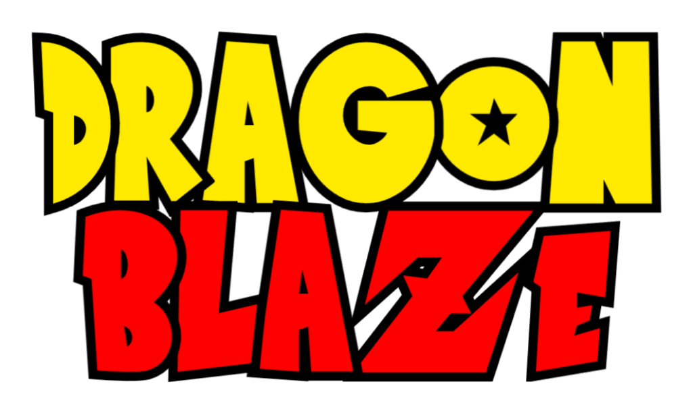

<h1 align="center">Dragon Blaze Online</h1>

(based on Intersect Engine)

[Wiki](https://github.com/Sh4d0v/dbo3/wiki) | [Milestone of 1.0](https://github.com/Sh4d0v/dbo3/milestone/1) | [Official Intersect Website](https://www.ascensiongamedev.com/) | [Documentation](https://docs.freemmorpgmaker.com/) | [Issues](https://github.com/Sh4d0v/belloo-x/issues) | [Intersect Discord](https://discord.gg/qaJ8kRmdKA) | [Intersect Repo](https://github.com/AscensionGameDev/Intersect-Engine) | [Intersect Downloads](https://www.ascensiongamedev.com/files/)

DragonBlaze Online (3) is an MMORPG (Massive Multiplayer Online Role Playing Game) based on the discontinued DBO2 project, which means that it allows multiple players to play simultaneously, connected to a virtual world. Players use the game client application to connect to the server. Taking on the role of a powerful warrior, they travel the world, cooperating or fighting with other players connected to the game. The whole game is set in a colorful, two-dimensional world modeled on Akira Toriyama's manga.

## 🪧 Requirements
-   [.NET 8 SDK](https://dotnet.microsoft.com/en-us/download/dotnet/8.0), verified for v8.0.12 (SDK 8.0.405)
-   git: required for cloning submodules, if you want to do this manually you don't need this and use the .zip download but that is not supported
-   *patience and programming skills*

## 🧩 Intersect Assets

Intersect is distributed with [custom assets](https://github.com/AscensionGameDev/Intersect-Assets) that have been curated from our community and around the net. Assets all match in style and are all safe to use freely in commercial projects.

## 🔗 Helpful Links

 * The official website is [freemmorpgmaker.com](https://freemmorpgmaker.com).
 * Our [issue tracker](https://github.com/AscensionGameDev/Intersect-Engine/issues) is on GitHub.
 * Use our [community forums](https://ascensiongamedev.com/) for support questions.
 * The [official documentation](https://docs.freemmorpgmaker.com) is on our website.
 * The official [Intersect Assets](https://github.com/AscensionGameDev/Intersect-Assets) repo is separate and can be found on GitHub.
 * Download stable and development [installers and packages](https://freemmorpgmaker.com/download).
